# POS Management System - Professional Edition (POS_504)

[](https://dotnet.microsoft.com/)
[](https://learn.microsoft.com/en-us/dotnet/csharp/)
[](https://www.oracle.com/database/)
[](https://learn.microsoft.com/en-us/dotnet/desktop/winforms/)
[](LICENSE)

A robust, full-featured **Point of Sale (POS) and Enterprise Retail Management System** built with **C# WinForms** and powered by **Oracle Database**. Designed with an **Executive Modern UI Theme**, ergonomic layouts for cashier workstations, and complete financial accounting tools.

ប្រព័ន្ធគ្រប់គ្រងការលក់ និងទំនិញ (POS Management System) បែបទំនើប Professional បង្កើតឡើងដោយប្រើប្រាស់ **C# .NET Framework (Windows Forms)** និងតភ្ជាប់ជាមួយ **Oracle Database**។

---

## 🌟 Highlights & Key Features

### 🛒 Point of Sale (POS) & Billing
- **Real-Time Cart & Checkout:** Quick product selection, barcode support, dynamic quantity/discount adjustments, and automatic total calculations.
- **Multi-Method Payments:** Seamless settlement via Cash, Bank Transfer (e.g. ABA Bank), and QR Code.
- **Transaction History:** Instant past sales auditing and invoice lookup.
- **Ergonomic Cashier Layout:** Dedicated "+ New Sale" workflow, unclipped cart controls, and high-visibility total badges.

### 📦 Purchasing & Supplier Supply Chain
- **Purchase Order (PO) Processing:** Direct supplier procurement, purchase pricing, and batch discounts.
- **Two-Tier Order Tracking:** Split view for active purchase line-items and comprehensive historical purchase logs.
- **Invoice Settlement:** Integrated settlement drawer with delete/void safeguards.

### 🗂 Master Catalog & Record Management
- **Products:** SKU, Barcode, English & Khmer item names, minimum stock alerts (`QtyAlert`), multi-unit pricing conversions (`UnitCls`), and image avatar uploads.
- **Customer Directory:** Full customer profiling with photo avatars, contact information, and active credit tracking.
- **Supplier & Staff Directory:** Complete vendor and staff database with image archiving and role assignments.
- **Categories & Units:** Hierarchical classifications and flexible measurement units (Piece, Pack, Box, etc.).

### 💰 Comprehensive Financial Accounting & Cash Flow
- **Drawer Balancing:** Opening drawer balance (`BeginingBalanceFrm`) and audit adjustments (`AccountAdjustFrm`).
- **Revenue & Expense Management:** Categorized operational expenses (`ExpenseFrm`, `ExpenseTypeFrm`) and non-sales revenues (`IncomeFrm`, `IncomeTypeFrm`).
- **Capital & Equity Management:** Capital contributions (`MoreCapitalFrm`), owner drawings (`OwnerDrawingFrm`), and inter-account transfers (`CashTransferFrm`).

### 📊 Reporting & Analytics
- **RDLC Report Engine:** Print-ready product catalogs, transaction logs, and printable receipts via Microsoft Report Viewer.

---

## 🎨 Modern Executive UI Theme (UITheme Engine)

All forms across the system are styled via a centralized design engine ([UITheme.cs](POS_504/Class/UITheme.cs)):

- **Eye-Care Slate Canvas (`#EBEFF4` / RGB: 235, 239, 244):** Eliminates harsh, blinding pure-white backgrounds for cashier long-shift eye comfort.
- **Executive Slate Workspace (`#DAE0E9`):** High-contrast MDI background highlighting open child forms.
- **Modern Pill-Rounded Buttons:** 6px radius smooth-curved buttons with modern Tailwind 500/600 color semantics:
  - 🟢 **Success (Insert / Save / Pay):** Emerald 500 (`#10B981`)
  - 🔵 **Info (New Sale / Add):** Sky 500 (`#0EA5E9`)
  - 🟠 **Warning (Update / Edit):** Amber 500 (`#F59E0B`)
  - 🔴 **Danger (Delete / Void):** Rose 500 (`#EF4444`)
  - ⚪ **Secondary (Close / Exit):** Slate 500 (`#64748B`)
  - 🟣 **Indigo (Browse Images):** Indigo 500 (`#6366F1`)
- **Zero-Clipping Layouts:** All dialog and setup forms are compacted to $\le 1360 \times 760$ px to guarantee zero cut-off buttons on laptops and standard 1080p displays.
- **Styled DataGridViews:** Slate-800 (`#1E293B`) headers, soft-slate alternating zebra rows (`#F3F6FA`), and clear row-selection styling.

---

## 🏛 System Architecture & Module Map

```mermaid
graph TD
    App[POS Management System]
    
    App --> Security[Security & Authentication]
    Security --> Login[LoginFrm]
    Security --> Main[MainFrm - MDI Hub]
    
    App --> Sales[Sales & Purchasing]
    Sales --> SaleFrm[SaleFrm - POS Terminal]
    Sales --> PurchaseFrm[PurchaseFrm - Supply PO]
    
    App --> Setup[Master Catalog Setup]
    Setup --> ProductFrm[Product & Unit Pricing]
    Setup --> CustomerFrm[Customer Directory]
    Setup --> SupplierFrm[Supplier Directory]
    Setup --> StaffFrm[Staff Directory]
    Setup --> UserFrm[User Accounts]
    Setup --> CategoryFrm[Product Categories]
    Setup --> UnitFrm[Measurement Units]
    
    App --> Finance[Financials & Cash Drawer]
    Finance --> Income[Income & Income Types]
    Finance --> Expense[Expense & Expense Types]
    Finance --> CashTransfer[Cash Transfers]
    Finance --> Equity[Capital & Drawings]
    Finance --> Adjust[Drawer & Balance Adjustments]
    
    App --> Reports[Reports & Analytics]
    Reports --> ProductRpt[RDLC Product Reports]
```



---

## 📂 Project Structure

```plaintext
POS_System/
├── POS_504.sln                         # Visual Studio Solution File
├── README.md                           # Project Documentation
├── .gitignore                          # Git Ignore Rules
└── POS_504/
    ├── App.config                      # Configuration & Connection Strings
    ├── Program.cs                      # Application Entry Point
    ├── POS_504.csproj                  # Project Definition
    ├── Class/                          # Business Logic & Helpers
    │   ├── UITheme.cs                  # Modern Executive UI Theme Engine
    │   ├── DatabaseConnection.cs       # Database Connection Handler
    │   ├── SaleInfoCls.cs              # Sales Business Logic
    │   ├── SaleDetailCls.cs            # Cart & Detail Logic
    │   ├── ProductCls.cs               # Product Management Logic
    │   ├── CustomerCls.cs              # Customer Records Logic
    │   ├── SupplierCls.cs              # Supplier Records Logic
    │   └── ...                         # Other Model Classes
    ├── Security/                       # Login & Main MDI Forms
    │   ├── LoginFrm.cs
    │   └── MainFrm.cs
    ├── Setup/                          # Master Setup & Operations
    │   ├── SaleFrm.cs                  # POS Billing Screen
    │   ├── PurchaseFrm.cs              # Purchase Order Screen
    │   ├── ProductFrm.cs               # Product Inventory Screen
    │   ├── CustomerFrm.cs              # Customer Management
    │   ├── SupplierFrm.cs              # Supplier Management
    │   ├── StaffFrm.cs                 # Staff Directory
    │   ├── UserFrm.cs                  # User Credentials
    │   ├── CategoryFrm.cs              # Category Management
    │   └── UnitFrm.cs                  # Units Management
    ├── Transaction/                    # Accounting & Drawer Forms
    │   ├── IncomeFrm.cs / IncomeTypeFrm.cs
    │   ├── ExpenseFrm.cs / ExpenseTypeFrm.cs
    │   ├── BeginingBalanceFrm.cs
    │   ├── CashTransferFrm.cs
    │   ├── MoreCapitalFrm.cs
    │   ├── OwnerDrawingFrm.cs
    │   └── AccountAdjustFrm.cs
    └── Report/                         # Reporting
        ├── ProductListRpt.cs
        └── ProductListRpt.rdlc         # RDLC Report Template
```

---

## 🚀 Getting Started

### Prerequisites
1. **Windows 10 / 11** or Windows Server.
2. **Visual Studio 2019 / 2022** (with *.NET desktop development* workload).
3. **.NET Framework 4.7.2** Developer Pack or Runtime.
4. **Oracle Database 11g / 12c / 19c / 21c / 23c** (or Oracle XE).
5. **ODP.NET Managed Driver** (`Oracle.ManagedDataAccess` via NuGet).

### Database Configuration
Update the connection string in `POS_504/App.config` to match your Oracle Database credentials and listener:

```xml
<connectionStrings>
  <add name="POS_504.Properties.Settings.ConnectionString"
       connectionString="USER ID=YOUR_USER;PASSWORD=YOUR_PASSWORD;DATA SOURCE=YOUR_HOST:1521/SERVICE_NAME;PERSIST SECURITY INFO=True"
       providerName="Oracle.ManagedDataAccess.Client" />
</connectionStrings>
```

### Build & Run
1. Clone this repository:
   ```bash
   git clone https://github.com/YimLemeng/POS_System.git
   cd POS_System
   ```
2. Open `POS_504.sln` in **Visual Studio**.
3. Restore NuGet packages (right-click Solution $\rightarrow$ **Restore NuGet Packages**).
4. Press **F5** or click **Start** to build and run the application.
5. Log in using your configured credentials.

---

## 🛡 Security & Best Practices
- **Transactions Rollback:** All multi-step sales and purchases utilize database transactions (`OracleTransaction`) with automatic rollback on error to maintain data integrity.
- **Input Sanitization:** Parameterized SQL queries are utilized across classes to prevent SQL injection.
- **Git Hygiene:** Build artifacts (`bin/`, `obj/`), user settings (`*.suo`, `*.user`), caches (`.vs/`), and OS metadata (`.DS_Store`) are strictly excluded via `.gitignore`.

---

## 👤 Author
- **Yim Lemeng** ([@YimLemeng](https://github.com/YimLemeng))
- Project Repository: [YimLemeng/POS_System](https://github.com/YimLemeng/POS_System)

---

## 📄 License
This project is licensed under the MIT License - feel free to use and adapt for commercial or educational projects.